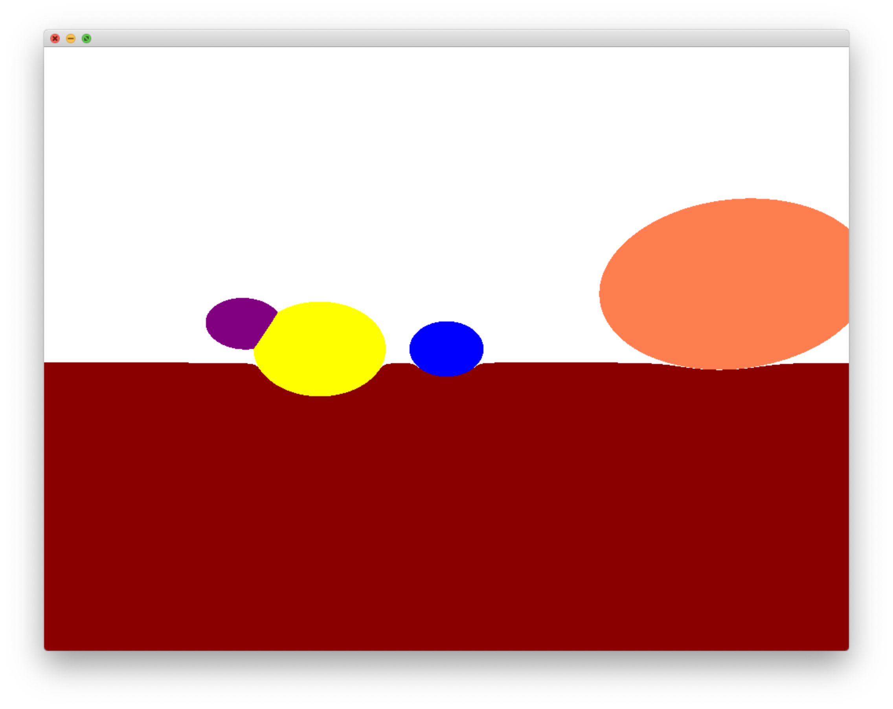
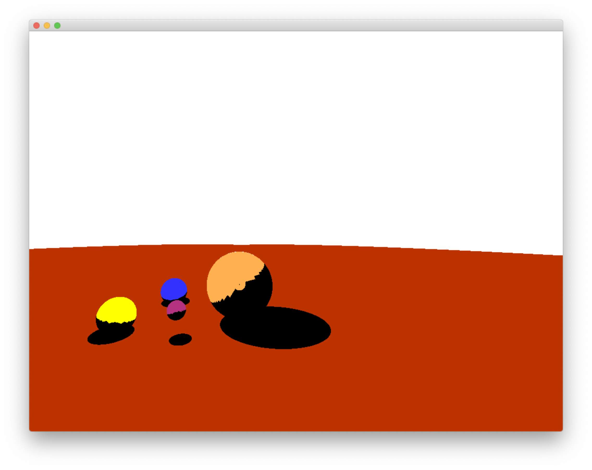
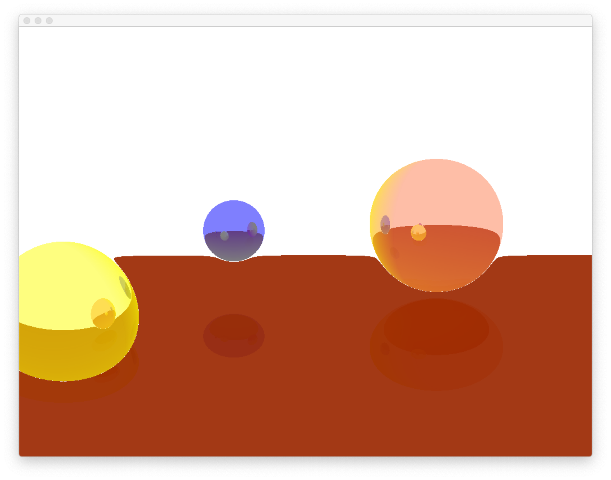
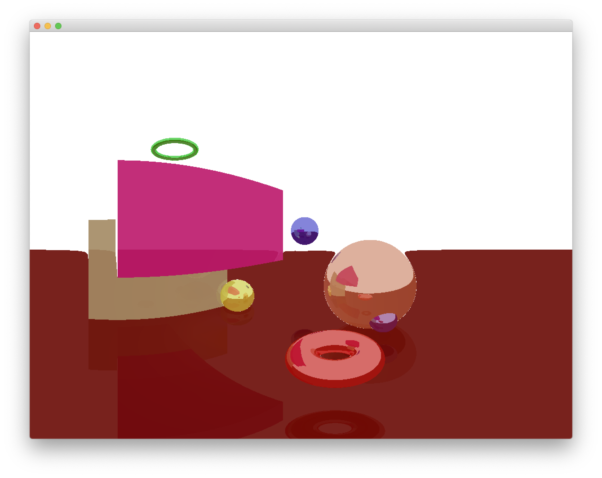
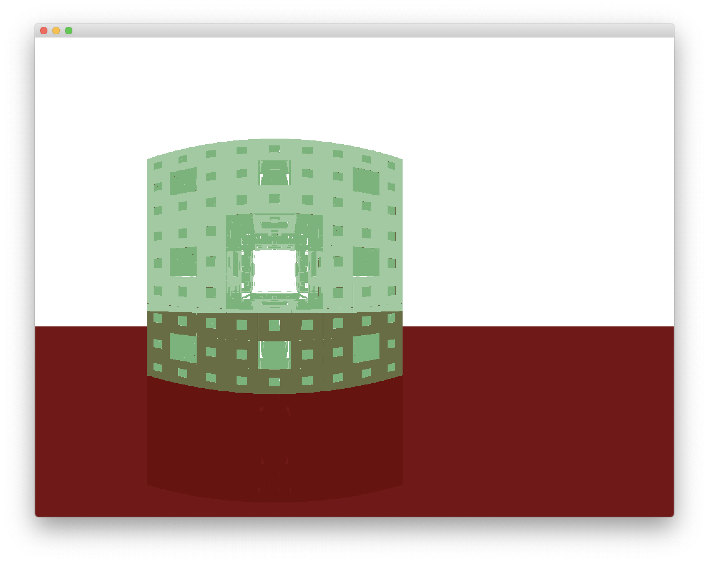

# Development Process

## Week 1 (Week of April 9)

### Goals for the week
- [x] Experiment with functions within ofxRaycaster and see how collisions and reflections work
- [x] Use the ofxRaycaster example to make simple ray reflection demo (using the example directly from ofxRaycaster but with more shapes
- [x] Create a simple ray marcher using `glm::vec3`s and simple math. (almost done)
- [ ] **Figure out why current model of ray tracing doesn't work and results in a seemingly infinite plane of objects**
- [ ] Use equations for perspective projection from [Wikipedia](https://en.wikipedia.org/wiki/3D_projection#Mathematical_formula) to improve the quality

### Notes
```
ofEnableDepthTest()
ofEnableLighting()
light.enable()
ofDisableLighting()
light.disable()
```
must be called each `draw()` loop!  
Can set roll, tilt, and pan of an object, and each object can have a parent attached that can rotate the object for it.  
Rays may not be useful as what I was trying to implement in the first place was a ray myself. Possibly using a `glm::vec3` and finding distance from it while maintaining a specific direction might be all that is necessary, in which case `ofxRaycaster` might be unimportant.  
**Time Spent: 4(?) hours**

`virtual` functions must have the encapsulating class implement a `virtual` destructor  
Inheritance in C++ is similar to Java but slightly different; cannot instantiate an abstract class, even if it is just an assignment of a variable (just because `Circle` is a `Shape` doesn't mean I can do `Shape a = Circle()` because of the `Shape a` declaration.  
**Time Spent: 6 hours**

Still stuck on debugging and figuring out why the ray marching seems like there is an infinite plane of objects.  
**Time Spent: 3 hours**

## Week 2 (Week of April 16)

### Goals for the week
- [x] Got the infinite plane bug to be fixed using a modified direction vector.
- [x] Got shading to work via a light source
- [x] Use spherical coordinates (plus possibly some linear algebra that I have not learned about before - [Rotation Matrix](https://en.wikipedia.org/wiki/Rotation_matrix)) to rotate the seeing plane to get a better grasp of what to see. 
- [x] Got shading of spheres to work
- [x] Got reflections of spheres on spheres to work
- [x] Finish player interaction (traversing the map using keys)
- [x] Different shapes (torus and box)
- [x] Research displaying fractals
- [x] Got Menger Fractal to work
- [ ] Look at Sierpinski's Tetrahedron or another easy fractal (maybe Mausoleum?)

### Notes
Direction vector is `vec3(pixelX, pixelY, innerWallZ)`. Not completely sure why, but [this ray marching tutorial](https://www.shadertoy.com/view/XlGBW3) had it this way. My original assumption was that it was because it was a simple example with the camera being located at the origin and therefore the direction vector from the ray origin to the pixel in 3D was `pixel3D - cameraPos`, but that doesn't seem to be the case. Will have to investigate this a bit more.  
**Time spent: 2 hours**
(Update (4/16/19): Was able to figure out why the direction vector was as above: that is showing that from the camera, the inner view wall will be set at 1 unit along the Z axis away from the camera and corresponding amounts away in the X and Y directions. This will be useful knowledge in figuring out how other angles and other views could be derived using other coordinate systems.)  
  
  
Was able to get light shading working by having a ray of light bounce off of the object and towards a light source (multiple light source color blending not supported yet) and figuring out whether the ray hits another object (casts a shadow on our object) or does reach the light source (update the color by blending with color of light source).  
**Time spent: 4.5 hours**  
  

Was able to get camera movements to work using spherical coordinates and a lot of drawings.  
Using [this blog site on Ray Marching](http://www.michaelwalczyk.com/blog/2017/5/25/ray-marching) as well as a lot of drawings, reflections and shading now work. The formula for the amount of light to cast on an object was interesting, including the dot product between the angle to the light source and the normal to the surface we're shooting our ray from. Implementing that allowed me to delete a long function from before that tried to serve the same purpose. The next goal would be to try to implement multiple light sources and how two light sources can interact/blend.  
  
**Time spent: 6 hours**  

Was able to get other shapes to display, including a box and a torus using distance functions from [this blog](http://iquilezles.org/www/articles/distfunctions/distfunctions.htm).  
  
**Time spent: 6 hours**  

Was able to get the Menger Fractal to work by following the blog post. Very computation intensive (lots of for loops everywhere), so tried making small optimizations to increase performance.  
  

## Week 3 (Week of April 23)

### Goals for the week
- [ ] ~~Have a batch of workers~~
- [ ] ~~Precompute distances~~
- [ ] ~~Look at optimizing for loops (L1 vs L2 caching?)~~
- [ ] Create a Tetrahedron that can be rotated
- [x] Create a Sierpinski Tetrahedron

### Notes
Didn't have that much time this week due to midterms and life, so not that much progress made this week. :(
Having a batch of workers is already done behind the scenes in `std::async` from the STL. Therefore, I was able to compare performance using XCode's profiler along with switching code out between `std::async` and `std::thread`, and came to the conclusion that `std::async` was slightly better. I also concluded that attempting to create new tasks for every single ray being shot out from the camera detrimented performance. From the small number of tests that I had done, it seems that splitting the screen into 4 different sections and multithreading the operation of finding the color of all of the pixels within that quarter of the screen was the best. Although I considered pre-computing distances, I wasn't 100% sure as to what volume around the user I should pre-compute distances and how to tell whether the user was on the exact pixel that I had pre-computed. Along with that, I was also confused as to how to store the pre-computed distances, since it required finding distances for every pixel. One possible way was just storing an `ofImage` with every single position, but that seemed a bit costly, so I hadn't experimented with it. Figuring out a good value for an epsilon for where to compute these `ofImage`s was also something I had to consider, so I refrained from doing so for this project.
I stared at my code for awhile to see where I could possibly decrease computation time, and took into account both my peers' suggestions and looked at the XCode Instruments profiler to see where most of the time was being spent, and found that it was, as I imagined, in the ray marching steps and in the distance functions, since those are being repeated so many times. Online, there seem to be some people calculating distance to fractals using iterative approaches instead of recursive, which would be great for efficiency, if it was understandable from my end.
In conclusion, the majority of this week was spent trying to find a good way to optimize my code, with little avail. The only changes I made were in changing from using `std::thread`s to `std::async`s and toying around with the idea of using multithreading to decrease computation time.  
**Time spent: too long**  

Finally created a Sierpinski Tetrahedron, and gave up on the goal of having it rotated properly, so just worked with a rotated tetrahedron. I tried to work out a good way of rotating any object, and came across multiple Wikipedia articles and graphics tools, but was not able to properly convert it into a format that was too useful for me. I was, however, able to get just a simple 90 degree rotation, which needed to happen to create a Sierpinski Tetrahedron (my method of creating it was subtracting a n upside down tetrahedron from a tetrahedron).  
**Time spent: 5 hours**  
  

## Week 4 (Week of April 29)
### Goals for the Week
- [x] Create a system for making new worlds easier
- [ ] ~~Another fractal?!?!~~ (no time :( )
- [ ] Look at GPU programming

Was able to make another set of inheritance classes that allows for easy world creation. The user has to create a class that has a constructor, where they would specify the objects being displayed and put it in a `shapes_` vector (and any `Light` objects in `lights_`) and a `Update(long millis)` method that can be called to update the shapes if necessary.
