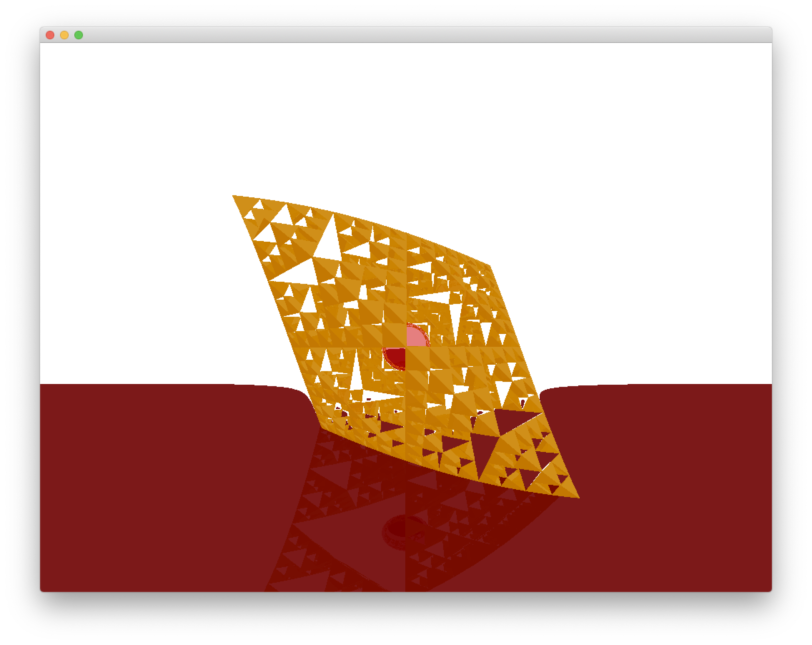

# Final Project

This is a project done for CS126: Software Design Studio at UIUC in the spring of 2019. This was originally developed for [openFrameworks](https://openframeworks.cc/) v0.10.0 but has been updated to v0.11.2.

## Proposals (See [PROPOSAL.md](PROPOSAL.md))

1. [Selected] Ray Marching using Distance Estimators
2. ~~Terrain Generation~~

## Progress (See [DEVELOPMENT.md](DEVELOPMENT.md))

## Screenshots and How to run

Current Progress:  
  

After forking the repository (on Mac):
```
export OF_ROOT=<root directory of OpenFrameworks>
make
make RunRelease
```
